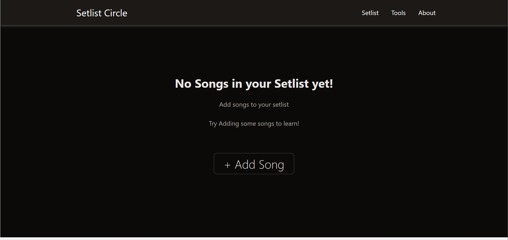
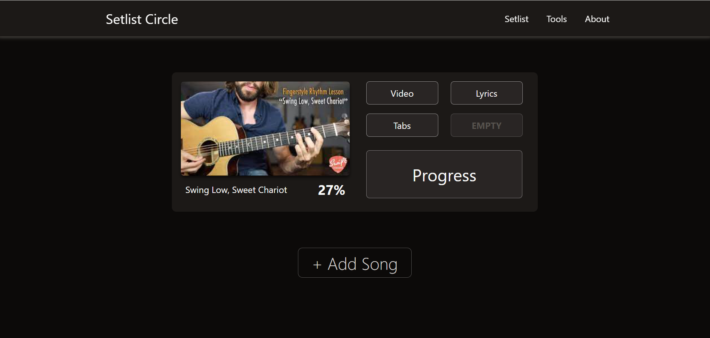

# Setlist Circle - Phase One

Welcome to Setlist Circle Phase One! Setlist Circle is your go-to platform for learning setlists, comparing progress with friends, and boosting your confidence in jams. With Setlist Circle, you can match up with your friends' progress, ensuring you're always ready and confident for your next jam session.

## Features

### 1. Dashboard Overview

Upon accessing the website, users are greeted with a user-friendly dashboard that provides an overview of essential features and functionalities.

### 2. Adding New Setlists

Users can easily add new setlists to their repertoire by inputting relevant details such as title, artist, and optional fields for tabs, lyrics, tutorials, videos, and metronome links.

### 3. Selecting Setlist Image

When adding a new setlist, users have the option to choose from provided images or upload their own image to represent the setlist.

### 4. Tracking Progress

Users can track their progress for individual songs within each setlist, marking them as "Learned" or "In Progress" to monitor their improvement over time.

### 5. Comparing with Friends

Users can compare their progress with friends who are also using Setlist Circle, fostering healthy competition and motivation to improve.

### 6. Timed Practice Sessions

To ensure effective practice sessions, users can initiate timed practice sessions for specific parts of a song. Before starting the timer, users must confirm that they are in tune.

### 7. Local Storage Integration

All data, including setlist details, song progress tracking, and practice session history, is stored locally within the browser.

### 8. Setlist Library Management

Users have full control over their setlist library, allowing them to add new setlists, edit existing ones, and remove setlists they no longer wish to learn.

### 9. Reviewing Old Setlists

Users can revisit and review setlists they have previously learned, with all setlist data remaining stored in the library for future reference.

# Setlist Circle - Phase Two

Welcome to Setlist Circle Phase Two! Setlist Circle is your ultimate platform for learning setlists, comparing progress with friends, and collaborating to master difficult parts. With Setlist Circle, you can now connect with friends, share resources, and support each other's musical journey.

## Features

### 1. User Authentication

- Users can sign up for a new account or log in to their existing account to access personalized features and connect with friends.

### 2. Dashboard Overview

- Upon logging in, users are greeted with a dashboard displaying personalized information, including setlists, friends' progress, and shared resources.

### 3. Adding New Setlists

- Users can easily add new setlists to their repertoire by inputting relevant details such as title, artist, and optional fields for tabs, lyrics, tutorials, videos, and metronome links.

### 4. Comparing with Friends

- Users can compare their progress with friends who are also using Setlist Circle, fostering healthy competition and motivation to improve.

### 5. Checking Friends' Setlists

- Users can view their friends' setlists and progress, gaining insights into what songs their friends are learning and mastering.

### 6. Sharing Resources

- Users can share resources such as tabs, tutorials, and videos with their friends, facilitating collaboration and learning from each other.

### 7. Helping Each Other Learn Difficult Parts

- Users can collaborate with friends to master difficult parts of songs by sharing tips, techniques, and practice strategies.

### 8. Backend Integration

- The backend server handles user authentication, data storage, and communication between users, providing a seamless experience for users.

## Screenshots

## Usage

1. Navigate to the website and access the dashboard.
2. Add new setlists to your repertoire by providing relevant details.
3. Track your progress for individual songs within each setlist.
4. Compare your progress with friends who are also using Setlist Circle.
5. Initiate timed practice sessions for specific song parts.
6. Manage your setlist library by adding, editing, or removing setlists.
7. Revisit and review old setlists stored in the library.

## License

This project is licensed under the [MIT License](LICENSE).
